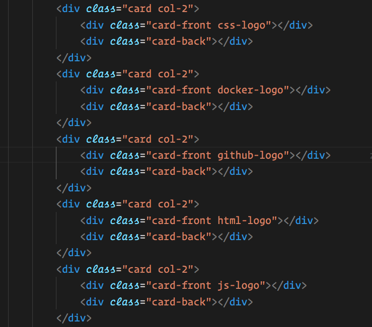

Instructions - Dynamic Cards Refactor
--

### Overview

In this feature:
- You will be adding the functionality to dynamically create the game cards.

    - To clarify what this means, `Dynamically` creating the cards means that you use JavaScript to create the game cards structure instead of hard coded HTML elements.

- There are no specific instructions for this Feature Set, as implementations can vary greatly, and we know you have the ability to do it on your own, but here are three requirements to consider:
  - You must recreate the entire HTML structure contained in the `<main>` element with the id of "gameCards"
      - example HTML structure:
        
  - The cards should be created dynamically when the application starts, and when the game is reset
  - When the game is reset, the old cards must be destroyed and replace with new cards

- Make sure to take another look at the Dom Creation 4 exercise [**here**](https://github.com/Learning-Fuze/lfz-lessons/tree/master/exercises/javascript-dom-creation-4)!
- When your game cards are being created dynamically on game start and game reset, move on to the `After Each Feature` section below.

### After Each Feature

- When your feature implementation is complete, you will want to save and submit your work to the branch that you have created.
  - Use `git status` to check that you are on the correct branch that represents your feature.
  - You will want to **add**, **commit**, and **push** the code that you have written to the appropriate Github repository.
    1. `git add .`
    2. `git commit -m "Description of the feature that you have implemented"`
       - e.g. `git commit -m "Added simple HTML skeleton"`
    3. `git push origin FEATURE_NAME_HERE`
       - e.g. `git push origin skeleton`

- Finally, you will want to create a pull request. This will merge the code from your newly **completed** feature branch into your `master` branch.

  1. Navigate to <kbd>New Pull Request</kbd>:
  
  2. Compare changes to merge:
  
  3. Create a new pull request:
  
  4. Merge the pull request:
  
  5. Update master with the new changes:
  - Note: you must `checkout` to the `master` branch and then `git pull origin master` to update your local `master` branch with the new code you just merged into the remote `master` branch.
  
  6. Create a pull request from your `feature` branch to the `student-reviews` branch and send the pull request to your lead instructor in Slack.
    - You will be deleting this branch only `AFTER` your pull request has been approved!

  7. Go back to [Features](../../README.md#features), if you're still working through the project.
